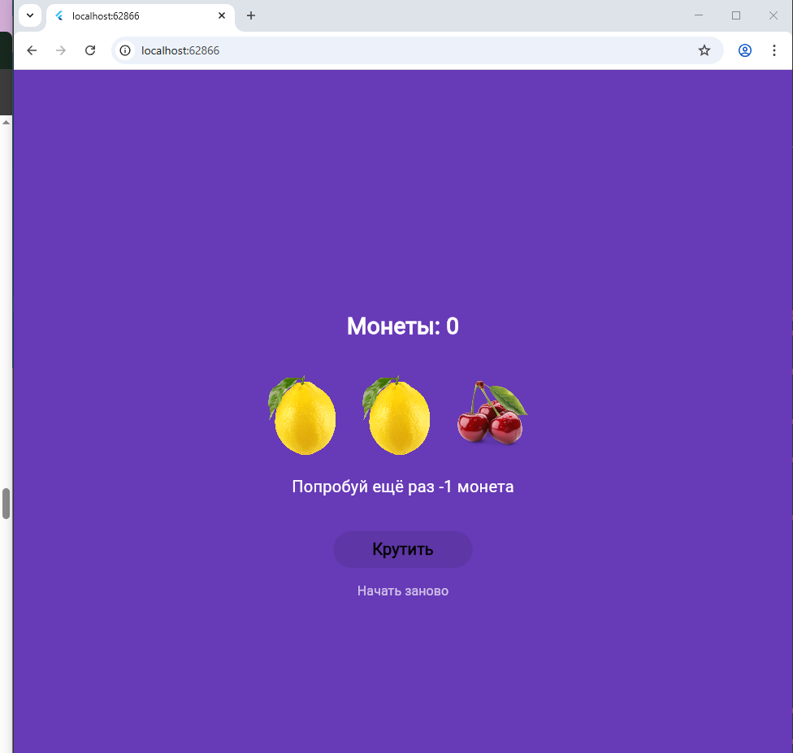
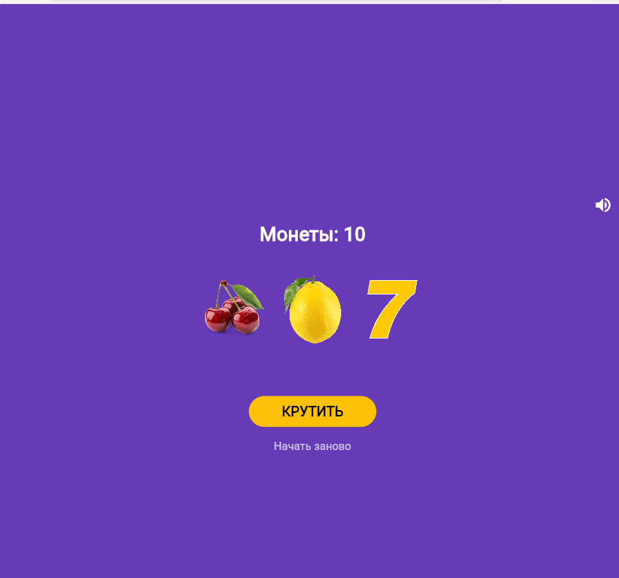
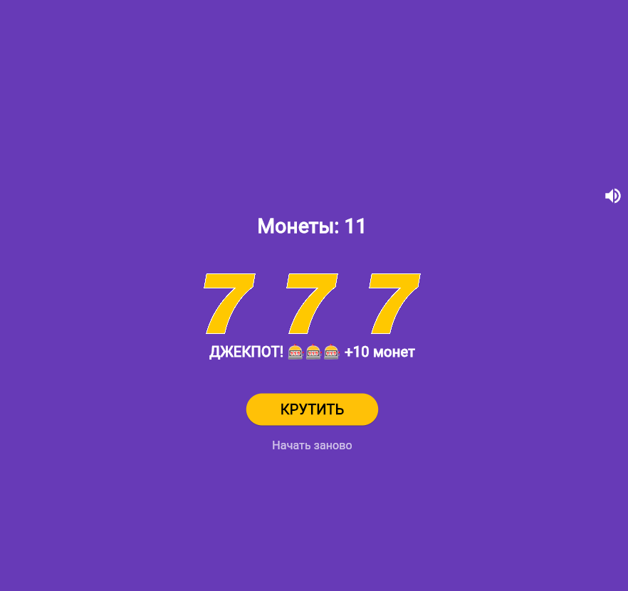
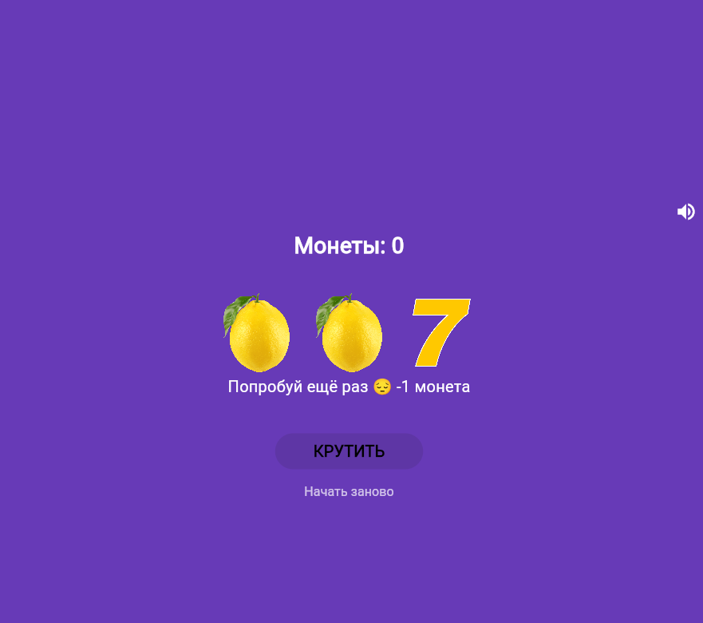

# Лабораторная работа №6. Flutter: StatefulWidget и управление состоянием

## Информация о студенте

- **Фамилия, Имя:** Рыхлюк Надежда
- **Группа:** ИСП-233


## Цель работы

Изучить разницу между StatelessWidget и StatefulWidget, научиться управлять состоянием приложения через setState(), подключать локальные изображения и обрабатывать нажатия кнопок на примере слот-машины.

## Что было изучено

1. **StatefulWidget vs StatelessWidget** — понял, что StatefulWidget позволяет хранить изменяемое состояние приложения, в отличие от StatelessWidget, который отрисовывается один раз и не меняется.

2. **Работа с setState()** — научился обновлять состояние виджета через метод setState(), который сигнализирует Flutter о необходимости перерисовать UI с новыми данными.

3. **Работа с assets** — освоил подключение локальных изображений через pubspec.yaml и их отображение с помощью виджета Image.asset().

4. **Асинхронное программирование** — реализовал анимацию вращения барабанов с использованием async/await и Future, что позволило создать реалистичную прокрутку с замедлением.

5. **Создание переиспользуемых виджетов** — вынес код барабанов в отдельный виджет SlotRow с обязательными параметрами (required), что улучшило структуру кода.

## Скриншоты приложения


### Заблокированная кнопка при 0 монет


### Требования
- Flutter SDK (версия 3.0 или выше)
- VS Code или Android Studio
- Браузер Chrome (для запуска в вебе)

### Установка и запуск
 ```bash
   git clone <URL_вашего_репозитория>
   cd slot_machine
   flutter pub get
   flutter run -d edge
```


# Учебное приложение. 🎰 Слот-машина 

Простое Flutter-приложение - симулятор казино. Крути барабаны, собирай одинаковые сиволы и выигрывай монеты!

## 📱Скриншоты
|Главный экран|Победа|Монеты закончились|
|:----:|:-----:|:----:|
||||
---

## Как играть

- Нажмите **КРУТИТЬ** чтобы запустить барабаны
- Три одинаковых символа — победа (+3 монеты)
- Три семёрки — джекпот (+10 монет)
- Разные символы — проигрыш (-1 монета)
- Начните заново кнопкой **Начать заново**

---
## 🚀 Запуск проекта

**Требования:** Flutter 3.x, Dart 3.x

# Перейти в папку
cd slot_machine

# Установить зависимости
flutter pub get

# Запустить в Chrome
flutter run -d chrome
```
---
## ⚙️ Технологии
- Flutter 3.41.2
- Dart 3.11.0
- Платформы: Web, Android
 
 ---
## 📚 Что изучено
- StatefulWidget и управление состоянием  через setState()
- Работа с локальными изображениями - через Image.asset()
- Генерация случайных чисел через dart:math
- Анимация через async/await и AnimatedOpacity
- Создание иконки в Krita и подключение через flutter_launcher_icons
- Сборка под Web и Android
- Работа со звуком:
--Web Audio API (для браузера)
--Пакет audioplayers (кроссплатформенное решение)

## 👤 Автор
Рыхлюк Надежда — группа ИСП-233
Лабораторная работа №6, 2026